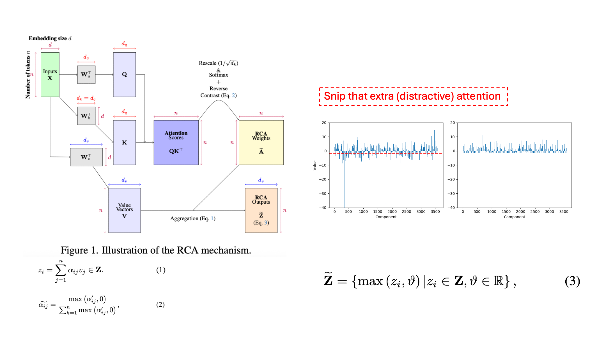

<!-- README.md -->

<p align="center">
  <strong>Interpretable Open-Vocabulary Referring Object Detection with<br>
  Reverse Contrast Attention</strong>
</p>

<p align="center">
  <em>Drandreb Earl O. Juanico<sup>1</sup>, Rowel O. Atienza<sup>1,2</sup>, Jeffrey Kenneth Go<sup>3</sup></em><br>
  <sup>1</sup>AI Graduate Program, University of the Philippines Diliman, Quezon City<br>
  <sup>2</sup>EEEI, University of the Philippines Diliman, Quezon City<br>
  <sup>3</sup>Samsung R &amp; D Institute Philippines<br>
  <a href="mailto:dojuanico@up.edu.ph">dojuanico@up.edu.ph</a>,
  <a href="mailto:earl.juanico@gmail.com">earl.juanico@gmail.com</a> •
  <a href="mailto:rowel@eee.upd.edu.ph">rowel@eee.upd.edu.ph</a> •
  <a href="mailto:jeff.go@samsung.com">jeff.go@samsung.com</a>
</p>

<p align="center">
  
</p>

<br/>

**Summary** (from full paper: [](https://www.arxiv.org/abs/2507.19891))

<p align="justify">
Reverse Contrast Attention (<b>RCA</b>) is a simple add-on that makes vision-language AIs pick out the right object in an image more accurately—all without retraining them. It tweaks the model’s “attention” so subtle but useful details matter more than extreme signals. In tests on a challenge where the AI must highlight any object mentioned in a sentence, RCA raised accuracy in most models—sometimes by more than 25 percent. It’s especially helpful for systems that combine image and text late in their processing, though others still see gains. 

<em>Bottom line:</em> RCA makes these multimodal AIs both easier to interpret and better at their job.
</p>

**<em>Attention is More Than You Need</em>**
<p align="center">
  
</p>

**Results**

<p align="justify">
Evaluation on COCO validation 2017 on rare classes using <em>FitAP</em> as a metric
</p>

<!-- Combined Table: VLMs, Architecture, and FitAP before/after RCA -->
<table align="center">
  <caption><b>Table 1. Selected VLMs from <a href="https://rank.opencompass.org.cn/leaderboard-multimodal/">OC-MMAL</a>, their architectures, and FitAP (<span>&#8593;</span>) before and after applying RCA.</b></caption>
  <tr>
    <th>Model</th>
    <th>Params</th>
    <th>LLM</th>
    <th>Vision</th>
    <th>pre-RCA</th>
    <th>post-RCA</th>
    <th>% Change</th>
  </tr>
  <tr><td><a href="https://huggingface.co/AIDC-AI/Ovis2-34B">Ovis2–34B</a></td><td>34.9B</td><td>Qwen2.5–32B</td><td>AIMv2–1B</td><td>3.23869</td><td>3.52222</td><td>+8.75</td></tr>
  <tr><td><a href="https://huggingface.co/BytedanceDouyinContent/SAIL-VL-1d6-8B">SAIL–VL–1.6–8B</a></td><td>8.33B</td><td>Qwen2.5–7B</td><td>AIMv2 Huge</td><td>4.84873</td><td>5.67149</td><td>+17.0</td></tr>
  <tr><td><a href="https://huggingface.co/yangjie-cv/WeThink-Qwen2.5VL-7B">WeThink–Qwen2.5VL–7B</a></td><td>8.29B</td><td>Qwen2.5–7B</td><td>QwenViT</td><td>39.9640</td><td>37.7606</td><td>–5.51</td></tr>
  <tr><td><a href="https://huggingface.co/Qwen/Qwen2.5-VL-7B-Instruct">Qwen2.5–VL–7B</a></td><td>8.29B</td><td>Qwen2.5–7B</td><td>QwenViT</td><td>37.0005</td><td>46.8535</td><td>+26.6</td></tr>
  <tr><td><a href="https://huggingface.co/openbmb/MiniCPM-o-2_6">MiniCPM–o–2.6</a></td><td>8.67B</td><td>Qwen2.5–7B</td><td>SigLIP–400M</td><td>0.03064</td><td>0.07334</td><td>+139</td></tr>
  <tr><td><a href="https://huggingface.co/bytedance-research/Valley2-DPO">valley2.dpo</a></td><td>8.88B</td><td>Qwen2.5–7B</td><td>SigLIP–400M</td><td>11.5145</td><td>11.6927</td><td>+1.55</td></tr>
  <tr><td><a href="https://huggingface.co/moonshotai/Kimi-VL-A3B-Instruct">Kimi–VL–A3B</a></td><td>16.4B</td><td>Moonlight–16B–A3B</td><td>MoonViT</td><td>30.7194</td><td>32.2176</td><td>+4.88</td></tr>
  <tr><td><a href="https://huggingface.co/LiAutoAD/Ristretto-3B">Ristretto–3B</a></td><td>3.84B</td><td>Qwen2.5–3B</td><td>SigLIP–400M</td><td>9.12887</td><td>7.94552</td><td>–13.0</td></tr>
  <tr><td><a href="https://huggingface.co/WePOINTS/POINTS-1-5-Qwen-2-5-7B-Chat">POINTS1.5–Qwen2.5–7B</a></td><td>8.3B</td><td>Qwen2.5–7B</td><td>NaViT</td><td>9.75203</td><td>9.45686</td><td>–3.03</td></tr>
  <tr><td><a href="https://huggingface.co/bytedance-research/Valley-Eagle-7B">Valley–Eagle</a></td><td>8.9B</td><td>Qwen2.5–7B</td><td>SigLIP–400M</td><td>11.7736</td><td>11.2598</td><td>–4.36</td></tr>
  <tr><td><a href="https://huggingface.co/google/gemma-3-27b-it">Gemma3–27B</a></td><td>27.4B</td><td>Gemma3–27B</td><td>SigLIP–400M</td><td>2.74179</td><td>3.01913</td><td>+10.1</td></tr>
  <tr><td><a href="https://huggingface.co/NCSOFT/VARCO-VISION-14B">VARCO–VISION–14B</a></td><td>15.2B</td><td>Qwen2.5–14B</td><td>SigLIP–400M</td><td>27.3592</td><td>28.7003</td><td>+4.90</td></tr>
  <tr><td><a href="https://huggingface.co/deepseek-ai/deepseek-vl2">DeepSeek–VL2</a></td><td>27.5B</td><td>DeepSeekMoE–27B</td><td>SigLIP–400M</td><td>3.38530</td><td>3.99586</td><td>+18.0</td></tr>
  <tr><td><a href="https://huggingface.co/google/paligemma2-3b-mix-448">PaliGemma2–3B–mix–448</a></td><td>3B</td><td>Gemma2–2B</td><td>SigLIP–400M</td><td>38.7982</td><td>41.1179</td><td>+5.98</td></tr>
  <tr><td><a href="https://huggingface.co/vikhyatk/moondream2">Moondream2</a></td><td>1.9B</td><td>Phi–1.5</td><td>SigLIP–400M</td><td>47.0039</td><td>47.0819</td><td>+0.17</td></tr>
</table>

<br/>


<p align="justify">
Example RCA-based improvements on a few VLM without retraining or fine-tuning
</p>

<div align="center">

  
  
  <b>Figure 1.</b> RCA effect on <b>Kimi-VL-A3B</b>
  
  <br/>

  
  
  <b>Figure 2.</b> RCA effect on <b>PaliGemma2-3B-mix-448</b>
  
  <br/>

  
  
  <b>Figure 3.</b> RCA effect on <b>Qwen2.5-VL-7B</b>
  
</div>

<!-- <p align="justify">
Example RCA-based improvements on a few VLM without retraining or fine-tuning
</p>

<p align="center">
  
</p>
<p align="center">
  
</p>
<p align="center">
  
</p> -->

## Instructions

1. We removed the ``*.safetensors`` and ``*.gguf`` files originally found in the respective Huggingface repository of the models. You may re-download them to the appropriate model directory using ``wget <Huggingface-repo>/file``.
2. The codes have been tested in a ``DGX x86_64`` system using ``conda`` environments. Please install Anaconda3 first.
3. Clone this repository with ``git clone https://github.com/earl-juanico/rca.git``
4. ``cd`` rca
5. Run the notebook ``Test-<vlm>`` for the ``vlm`` of interest. These notebooks are found in ``./exploratory``. 
6. You may need to install the correct conda environment settings. See the top cell of the notebook.

## Additional details

You may read additional description about **RCA** from this <a href="https://1ico-opc.blogspot.com/2025/07/blog-post.html">blog</a>.

## Cite

If you use this work, please cite:

```bibtex
@article{juanico2025interpretable,
  title={Interpretable Open-Vocabulary Referring Object Detection with Reverse Contrast Attention},
  author={Juanico, Drandreb Earl O and Atienza, Rowel O and Go, Jeffrey Kenneth},
  journal={arXiv preprint arXiv:2507.19891},
  year={2025}
}
```
