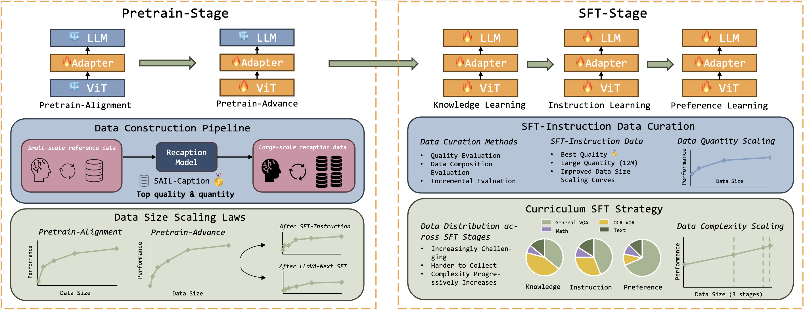

## Introduction


SAIL-VL is a state-of-the-art vision-language model (VLM) developed by the Bytedance Douyin Content Team. The goal of SAIL-VL is to develope a high-performance vision language model that facilitates deployment on mobile devices and ensures accessibility and affordability for a broad audience. Through careful tuning of data and training recipes, SAIL-VL demonstrates that even a small VLM can benefit significantly from data scaling.

SAIL-VL-V1.5-pro-8B is the brand new version of our model based on SAIL-VL-v1.5-8B, which incorporates advanced techniques to achieve higher performance. For visual encoding, we use the stronger AIM-V2 ViT as our vision encoder. During training, we introduce an adaptive stream packing strategy to support higher throughput and longer sequences. Finally, we add more conversation and reasoning data, filter out noisy data and add a new training stage for videos. With all these updates, our model outperforms recent SoTA models of comparable sizes, InternVL-2.5-8B, Qwen2.5-VL-7B, Ovis2-8B and recently released InternVL-3-8B.

Please enjoy our model and feel free to contact us for any question or opportunity.

## News🚀🚀🚀
- 2024-4-22: 📖 We released the SAIL-VL-1.6-8B at [🤗SAIL-VL-1.6-8B](https://huggingface.co/BytedanceDouyinContent/SAIL-VL-1.6-8B)
- 2024-4-16: 📖 We released our powerful v1.5 series models, check out at [🤗SAIL-VL-1.5-2B](https://huggingface.co/BytedanceDouyinContent/SAIL-VL-1.5-2B)  [🤗SAIL-VL-1.5-8B](https://huggingface.co/BytedanceDouyinContent/SAIL-VL-1.5-8B) ~
- 2024-2-19: 📖 We released our 8B model, check out at [🤗SAIL-VL-8B](https://huggingface.co/BytedanceDouyinContent/SAIL-VL-8B) ~
- 2024-1-10: 📖 We released our paper on Arxiv: [Scalable Vision Language Model Training via High Quality Data Curation
](https://arxiv.org/abs/2501.05952)
- 2024-12-25: 🚀 We ranked the 1st in [OpenCompass Multi-modal Leaderboard](https://rank.opencompass.org.cn/leaderboard-multimodal/?m=REALTIME) among models of 2B parameters.
## Model Card

### Model Architecture:

| Architecture | ViT | LLM | Adapter | Token Merge | Resolution |
| --- | --- | --- | --- | --- | --- |
| [🤗SAIL-VL-1.6-8B](https://huggingface.co/BytedanceDouyinContent/SAIL-VL-1.6-8B) | [🤗AimV2-Huge](https://huggingface.co/apple/aimv2-huge-patch14-448) | [🤗Qwen2.5-7B](https://huggingface.co/Qwen/Qwen2.5-1.5B-Instruct) | 2-layer MLP | 2x2 | 448x448xN |
| [🤗SAIL-VL-1.5-2B](https://huggingface.co/BytedanceDouyinContent/SAIL-VL-1.5-2B) | [🤗AimV2-Huge](https://huggingface.co/apple/aimv2-huge-patch14-448) |[🤗Qwen2.5-1.5B](https://huggingface.co/Qwen/Qwen2.5-1.5B-Instruct) | 2-layer MLP | 2x2 | 448x448xN | 
| [🤗SAIL-VL-1.5-8B](https://huggingface.co/BytedanceDouyinContent/SAIL-VL-1.5-8B) | [🤗InternViT-300M](https://huggingface.co/OpenGVLab/InternViT-300M-448px) | [🤗Qwen2.5-7B](https://huggingface.co/Qwen/Qwen2.5-1.5B-Instruct) | 2-layer MLP | 2x2 | 448x448xN |
| [🤗SAIL-VL-2B](https://huggingface.co/BytedanceDouyinContent/SAIL-VL-2B) | [🤗InternViT-300M](https://huggingface.co/OpenGVLab/InternViT-300M-448px) | [🤗Qwen2.5-1.5B](https://huggingface.co/Qwen/Qwen2.5-1.5B-Instruct) | 2-layer MLP | 2x2 | 448x448xN |
| [🤗SAIL-VL-8B](https://huggingface.co/BytedanceDouyinContent/SAIL-VL-8B) | [🤗InternViT-300M](https://huggingface.co/OpenGVLab/InternViT-300M-448px) | [🤗Qwen2.5-7B](https://huggingface.co/Qwen/Qwen2.5-1.5B-Instruct) | 2-layer MLP | 2x2 | 448x448xN |

### Training Recipes Overview:

Sail-VL benefits from high-quality data and carefully curated training recipes. We find the data quality, quantity and the design of curriculum training pipeline are crucial for model performance. With the proper design and data, the model's capacity scales effectively with data expansion at all stages, leading to enhanced performance.




## Evaluation

SAIL-VL is competitive compared with recently released SoTAs, InternVL-2.5, Qwen2.5-VL, Ovis-2 and InternVL3.


### Detail Evaluations:

| Benchmark           | InternVL-2.5-8B | Qwen2.5-VL-7B | InternVL3-8B | Ovis2-8B | SAIL-VL-1.5-8B | SAIL-VL-1.6-8B
|---------------------|------------|----------|--------------|--------------|---------------|---------------|
| OpenCompassAvg      | 68.56      | 70.26    | 73.84        | 72.25        | 72.69      | 74.26      |
| Total Avg           | 73.84      | 76.02    | 77.55        | 77.08        | 77.41      | 78.62      |
| GeneralQA Avg       | 71.37      | 70.15    | 74.44        | 72.83        | 72.64      | 73.56      |
| OCR Avg             | 83.19      | 87.33    | 85.21        | 86.87        | 87.20      | 88.11      |
| MMBench_DEV_V11 *   | 86.95      | 86.58    | 89.68        | 88.00        | 87.43      | 88.82      |
| MathVista_MINI      | 65.00      | 66.30    | 70.60        | 70.90        | 73.60      | 74.50      |
| MMStar *            | 62.93      | 63.93    | 68.60        | 64.07        | 69.40      | 69.47      |
| MMMU_VAL *          | 54.33      | 50.33    | 56.78        | 56.44        | 50.44      | 53.11      |
| MMVet               | 63.58      | 67.20    | 82.57        | 66.97        | 69.77      | 74.72      |
| HallusionBench      | 49.14      | 55.97    | 49.00        | 55.92        | 54.03      | 54.96      |
| AI2D_TEST +         | 84.42      | 84.00    | 85.17        | 86.82        | 87.37      | 87.50      |
| OCRBench +          | 821        | 878      | 883          | 889          | 895        | 910        |
| RealWorldQA *       | 69.28      | 67.71    | 70.59        | 72.81        | 72.42      | 75.42      |
| InfoVQA_VAL +       | 75.19      | 82.83    | 75.71        | 80.52        | 79.68      | 80.70      |
| ChartQA_TEST +      | 86.28      | 89.52    | 88.00        | 87.44        | 89.32      | 89.08      |
| MME *               | 83.38      | 82.21    | 86.55        | 82.84        | 83.52      | 80.97      |
| DocVQA_VAL +        | 92.05      | 94.84    | 92.03        | 94.21        | 94.17      | 94.86      |
| TextVQA_VAL +       | 79.08      | 85.00    | 82.07        | 83.34        | 83.13      | 85.52      |


Details for average performance section:
- OpenCompass-Avg includes public avaliable validation sets from OpenCompass: AI2D_TEST, HallusionBench, MMBench_DEV_V11, MMMU_DEV_VAL, MMStar, MMVet, MathVista_MINI, evaluated by our team.

- GeneralQA-Avg includes datasets with "*" mark.

- OCR-Avg includes datasets with "+" mark.

## How to Use

The basic usage and dynamic crop strategy of SAIL-VL follows InternVL2, you can easily switch Intern-VL series of models to our model. Here is a simple example of using our model:

### Requirements:
```
pip3 install einops transformers timm
```

### Code:

```Python
import numpy as np
import torch
import torchvision.transforms as T
from PIL import Image
from torchvision.transforms.functional import InterpolationMode
from transformers import AutoModel, AutoTokenizer

IMAGENET_MEAN = (0.485, 0.456, 0.406)
IMAGENET_STD = (0.229, 0.224, 0.225)

def build_transform(input_size):
    MEAN, STD = IMAGENET_MEAN, IMAGENET_STD
    transform = T.Compose([
        T.Lambda(lambda img: img.convert('RGB') if img.mode != 'RGB' else img),
        T.Resize((input_size, input_size), interpolation=InterpolationMode.BICUBIC),
        T.ToTensor(),
        T.Normalize(mean=MEAN, std=STD)
    ])
    return transform

def find_closest_aspect_ratio(aspect_ratio, target_ratios, width, height, image_size):
    best_ratio_diff = float('inf')
    best_ratio = (1, 1)
    area = width * height
    for ratio in target_ratios:
        target_aspect_ratio = ratio[0] / ratio[1]
        ratio_diff = abs(aspect_ratio - target_aspect_ratio)
        if ratio_diff < best_ratio_diff:
            best_ratio_diff = ratio_diff
            best_ratio = ratio
        elif ratio_diff == best_ratio_diff:
            if area > 0.5 * image_size * image_size * ratio[0] * ratio[1]:
                best_ratio = ratio
    return best_ratio

def dynamic_preprocess(image, min_num=1, max_num=10, image_size=448, use_thumbnail=False):
    orig_width, orig_height = image.size
    aspect_ratio = orig_width / orig_height

    # calculate the existing image aspect ratio
    target_ratios = set(
        (i, j) for n in range(min_num, max_num + 1) for i in range(1, n + 1) for j in range(1, n + 1) if
        i * j <= max_num and i * j >= min_num)
    target_ratios = sorted(target_ratios, key=lambda x: x[0] * x[1])

    # find the closest aspect ratio to the target
    target_aspect_ratio = find_closest_aspect_ratio(
        aspect_ratio, target_ratios, orig_width, orig_height, image_size)

    # calculate the target width and height
    target_width = image_size * target_aspect_ratio[0]
    target_height = image_size * target_aspect_ratio[1]
    blocks = target_aspect_ratio[0] * target_aspect_ratio[1]

    # resize the image
    resized_img = image.resize((target_width, target_height))
    processed_images = []
    for i in range(blocks):
        box = (
            (i % (target_width // image_size)) * image_size,
            (i // (target_width // image_size)) * image_size,
            ((i % (target_width // image_size)) + 1) * image_size,
            ((i // (target_width // image_size)) + 1) * image_size
        )
        # split the image
        split_img = resized_img.crop(box)
        processed_images.append(split_img)
    assert len(processed_images) == blocks
    if use_thumbnail and len(processed_images) != 1:
        thumbnail_img = image.resize((image_size, image_size))
        processed_images.append(thumbnail_img)
    return processed_images

def load_image(image_file, input_size=448, max_num=10):
    image = Image.open(image_file).convert('RGB')
    transform = build_transform(input_size=input_size)
    images = dynamic_preprocess(image, image_size=input_size, use_thumbnail=True, max_num=max_num)
    pixel_values = [transform(image) for image in images]
    pixel_values = torch.stack(pixel_values)
    return pixel_values

path = "BytedanceDouyinContent/SAIL-VL-1.5-2B"
model = AutoModel.from_pretrained(
    path,
    torch_dtype=torch.bfloat16,
    trust_remote_code=True).eval().cuda()
tokenizer = AutoTokenizer.from_pretrained(path, trust_remote_code=True, use_fast=False)

# set the max number of tiles in `max_num`
pixel_values = load_image('./test.png', max_num=10).to(torch.bfloat16).cuda()
generation_config = dict(max_new_tokens=1024, do_sample=True)

# pure-text conversation
question = 'Hello, who are you?'
response, history = model.chat(tokenizer, None, question, generation_config, history=None, return_history=True)
print(f'User: {question}         Assistant: {response}')

question = 'Can you tell me a story?'
response, history = model.chat(tokenizer, None, question, generation_config, history=history, return_history=True)
print(f'User: {question}         Assistant: {response}')

# single-image single-round conversation
question = '<image>         Please describe the image shortly.'
response = model.chat(tokenizer, pixel_values, question, generation_config)
print(f'User: {question}         Assistant: {response}')

# single-image multi-round conversation
question = '<image>         Please describe the image in detail.'
response, history = model.chat(tokenizer, pixel_values, question, generation_config, history=None, return_history=True)
print(f'User: {question}         Assistant: {response}')

question = 'Please write a poem according to the image.'
response, history = model.chat(tokenizer, pixel_values, question, generation_config, history=history, return_history=True)
print(f'User: {question}         Assistant: {response}')
```
<br>

## Acknowledge

Our model is built upon numerous outstanding open-source projects, and we are grateful for their contributions. We extend special thanks to the InternVL team and Qwen team for their great base models, and to the BAAI team (Infinity-MM) for their generous release of data.

## Citation
```
@article{dong2025scalable,
  title={Scalable vision language model training via high quality data curation},
  author={Dong, Hongyuan and Kang, Zijian and Yin, Weijie and Liang, Xiao and Feng, Chao and Ran, Jiao},
  journal={arXiv preprint arXiv:2501.05952},
  year={2025}
}
```
```
@misc{
    sailvl,
    title = {SAIL-VL: Scalable Vision Language Model Training with High Quality Data Curation},
    url = {https://huggingface.co/BytedanceDouyinContent/SAIL-VL-2B/},
    author = {Bytedance Douyin Content Team},
    month = {December},
    year = {2024}
}
```
## Contributions
This work is conducted by Bytedance Douyin Content Team, authored by:
```
{Hongyuan Dong, Zijian Kang, Weijie Yin}, Xiao Liang, Chao Feng, Jiao Ran

{*} Equal Contributions.
```
We also appreciate the support from the model evaluation team:
```
Zirui Guo, Yan Qiu, Yaling Mou, Ming Jiang, Jingwei Sun
```
And from AI platform team:
```
Huiyu Yu, Lin Dong, Yong Zhang
```


## License

This project is licensed under [Apache License 2.0](LICENSE).

## Contact

If you have any question, please feel free to contact us: BytedanceDouyinContent@bytedance.com