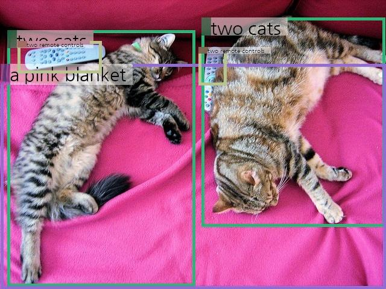
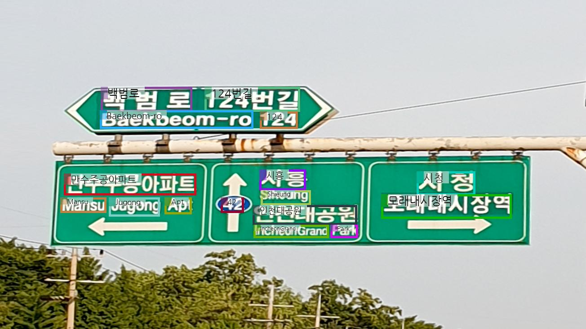

---
language:
- en
- ko
license: cc-by-nc-4.0
tags:
- multimodal
- conversational
- ncsoft
- varco
base_model:
- Qwen/Qwen2.5-14B-Instruct
- google/siglip-so400m-patch14-384
library_name: transformers
pipeline_tag: image-text-to-text
---

# VARCO-VISION-14B-HF

## About the Model

**VARCO-VISION-14B** is a powerful English-Korean Vision-Language Model (VLM). The training pipeline of VARCO-VISION consists of four stages: Feature Alignment Pre-training, Basic Supervised Fine-tuning, Advanced Supervised Fine-tuning, and Preference Optimization. In both multimodal and text-only benchmarks, VARCO-VISION-14B not only surpasses other models of similar size in performance but also achieves scores comparable to those of proprietary models.  The model currently accepts a single image and a text as inputs, generating an output text. It supports grounding, referring as well as OCR (Optical Character Recognition).

- **Developed by:** NC Research, Multimodal Generation Team
- **Technical Report:** [VARCO-VISION: Expanding Frontiers in Korean Vision-Language Models](https://arxiv.org/pdf/2411.19103)
- **Blog(Korean):** [VARCO-VISION Technical Report Summary](https://ncsoft.github.io/ncresearch/95ad8712e60063e9ac97538504ac3eea0ac530af)
- **Demo Page:** *The demo page is no longer available.*
- **Languages:** Korean, English
- **License:** CC BY-NC 4.0
- **Architecture:** VARCO-VISION-14B follows the architecture of [LLaVA-OneVision](https://arxiv.org/abs/2408.03326).
- **Base Model:**
  - **Language Model:** [Qwen/Qwen2.5-14B-Instruct](https://huggingface.co/Qwen/Qwen2.5-14B-Instruct)
  - **Vision Encoder:** [google/siglip-so400m-patch14-384](https://huggingface.co/google/siglip-so400m-patch14-384)
- **LLaVA-NeXT Codebase Model:** [NCSOFT/VARCO-VISION-14B](https://huggingface.co/NCSOFT/VARCO-VISION-14B)
- **Korean VLM Benchmarks:**
  - You can use the following benchmark datasets in the [LLMs-Eval toolkit](https://github.com/EvolvingLMMs-Lab/lmms-eval).
  - [NCSOFT/K-MMBench](https://huggingface.co/datasets/NCSOFT/K-MMBench)
  - [NCSOFT/K-SEED](https://huggingface.co/datasets/NCSOFT/K-SEED)
  - [NCSOFT/K-MMStar](https://huggingface.co/datasets/NCSOFT/K-MMStar)
  - [NCSOFT/K-DTCBench](https://huggingface.co/datasets/NCSOFT/K-DTCBench)
  - [NCSOFT/K-LLaVA-W](https://huggingface.co/datasets/NCSOFT/K-LLaVA-W)
  
- **you can also evaluate VARCO-VISION-14B in the [VLMEval kit](https://github.com/open-compass/VLMEvalKit)**.
- **This model is for research purposes only. Commercial use is prohibited.**


## Uses

### Direct Use
To use this model, ensure you have `transformers >= 4.45.0` installed.

```python
import torch
import requests
from PIL import Image
from transformers import LlavaOnevisionForConditionalGeneration, AutoProcessor

model_name = "NCSOFT/VARCO-VISION-14B-HF"
model = LlavaOnevisionForConditionalGeneration.from_pretrained(
        model_name,
        torch_dtype="float16",
        device_map="auto",
        attn_implementation="flash_attention_2"
    )
processor = AutoProcessor.from_pretrained(model_name)
device = model.device

# Define a chat history and use `apply_chat_template` to get correctly formatted prompt
# Each value in "content" has to be a list of dicts with types ("text", "image")
conversation = [
    {
        "role": "user",
        "content": [
            {"type": "text", "text": "Describe this image."},
            {"type": "image"},
        ],
    },
]

prompt = processor.apply_chat_template(conversation, add_generation_prompt=True)

EOS_TOKEN = "<|im_end|>"
image_file = "http://images.cocodataset.org/val2017/000000039769.jpg"
raw_image = Image.open(requests.get(image_file, stream=True).raw)
inputs = processor(images=raw_image, text=prompt, return_tensors='pt').to(device, torch.float16)

output = model.generate(**inputs, max_new_tokens=1024, do_sample=False)
output = processor.decode(output[0][inputs.input_ids.shape[1]:])
if output.endswith(EOS_TOKEN):
    output = output[: -len(EOS_TOKEN)]

output = output.strip()
print(output)
```

### Specialized Features

If a question is based on bounding boxes or require bounding boxes as an output, please include the special tokens in the input text.
 
The following special tokens are used to define specific tasks, inputs, and outputs for the model:

- `<gro>`: Indicates that the model's response should include bounding box information.
- `<ocr>`: Specifies OCR tasks for recognizing text within an image.
- `<char>` and `</char>`: Used to mark a text phrase.
- `<obj>` and `</obj>`: Used to indicate an object.
- `<bbox>` and `</bbox>`: Used to represent a bounding box.
- `<delim>`: Represents multiple location points for a single object or text.

#### Grounding

Grounding refers to a task where the model needs to identify specific locations within an image to provide an appropriate answer. To perform grounding, prepend the special token `<gro>` to the question.

```python
conversation = [
    {
        "role": "user",
        "content": [
            {"type": "text", "text": "<gro>\nDescribe the image in detail."},
            {"type": "image"},
        ],
    },
]
```

**Expected Output Example:**
```html
The image shows <obj>two cats</obj><bbox>0.014, 0.106, 0.51, 0.996<delim>0.51, 0.054, 0.996, 0.787</bbox> lying on <obj>a pink blanket</obj><bbox>0.003, 0.231, 0.999, 0.999</bbox>. The cat on the left is lying on its side with its head resting on the blanket, while the cat on the right is lying on its stomach with its head also resting on the blanket. Both cats appear to be relaxed and comfortable. There are <obj>two remote controls</obj><bbox>0.037, 0.141, 0.283, 0.253<delim>0.506, 0.171, 0.581, 0.295</bbox> placed near the cats, one on the left side and one on the right side of the image.
```



#### Referring

VARCO-VISION-14B can handle location-specific questions using bounding boxes. To perform referring tasks, make a conversation including the object of interest within `<obj>` and `</obj>` tags. You have to specify its location with `<bbox>` and `</bbox>` tags. This allows the model to understand the context and focus on the object at the specified location. A bbox is represented in a form of (x1, y1, x2, y2). The first two values indicate the top-left position of a bbox, and the latter two values are the bottom-right position.

```python
conversation = [
    {
        "role": "user",
        "content": [
            {
                "type": "text",
                "text": "<obj>이 물건</obj><bbox>0.039, 0.138, 0.283, 0.257</bbox>은 어떻게 쓰는거야?",
            },
            {"type": "image"},
        ],
    },
]
```

**Expected Output Example:**
```
**이 물건**은 리모컨으로, 주로 텔레비전이나 다른 전자 기기를 원격으로 조작하는 데 사용됩니다. 리모컨에는 다양한 버튼이 있으며, 각  버튼은 채널 변경, 볼륨 조절, 전원 켜기/끄기 등의 기능을 수행합니다. 사용자는 리모컨을 손에 들고 버튼을 누르면, 해당 기기에 신호를 보내 원하는 조작을 할 수 있습니다. 리모컨은 일반적으로 가정이나 사무실에서 편리하게 전자 기기를 조작할 수 있도록 사용됩니다.
```

#### OCR

To perform Optical Character Recognition (OCR), use the `<ocr>` token.

```python
image_file = "./assets/ocr_1.png"
raw_image = Image.open(image_file)

conversation = [
    {
        "role": "user",
        "content": [
            {"type": "text", "text": "<ocr>"},
            {"type": "image"},
        ],
    },
]
```

**Expected Output Example:**

```
<char>백범로</char><bbox>0.172, 0.266, 0.328, 0.341</bbox>
<char>124번길</char><bbox>0.347, 0.266, 0.512, 0.341</bbox>
<char>Baekbeom-ro</char><bbox>0.171, 0.337, 0.433, 0.392</bbox>
<char>124</char><bbox>0.444, 0.341, 0.508, 0.392</bbox>
<char>만수주공아파트</char><bbox>0.109, 0.531, 0.335, 0.601</bbox>
<char>시흥</char><bbox>0.443, 0.518, 0.522, 0.581</bbox>
<char>시청</char><bbox>0.711, 0.521, 0.811, 0.594</bbox>
<char>Mansu</char><bbox>0.102, 0.601, 0.181, 0.648</bbox>
<char>Jugong</char><bbox>0.186, 0.601, 0.273, 0.658</bbox>
<char>Apt</char><bbox>0.28, 0.601, 0.327, 0.651</bbox>
<char>42</char><bbox>0.377, 0.601, 0.416, 0.648</bbox>
<char>Shieung</char><bbox>0.445, 0.578, 0.53, 0.625</bbox>
<char>인천대공원</char><bbox>0.43, 0.621, 0.609, 0.684</bbox>
<char>모래내시장역</char><bbox>0.651, 0.59, 0.873, 0.665</bbox>
<char>IncheonGrand</char><bbox>0.432, 0.681, 0.561, 0.723</bbox>
<char>Park</char><bbox>0.564, 0.681, 0.611, 0.723</bbox>
```



## Citing the Model

If you use VARCO-VISION-14B in your research, please cite the following: 

```bibtex
@misc{ju2024varcovisionexpandingfrontierskorean,
    title={VARCO-VISION: Expanding Frontiers in Korean Vision-Language Models}, 
    author={Jeongho Ju and Daeyoung Kim and SunYoung Park and Youngjune Kim},
    year={2024},
    eprint={2411.19103},
    archivePrefix={arXiv},
    primaryClass={cs.CV},
    url={https://arxiv.org/abs/2411.19103}, 

```