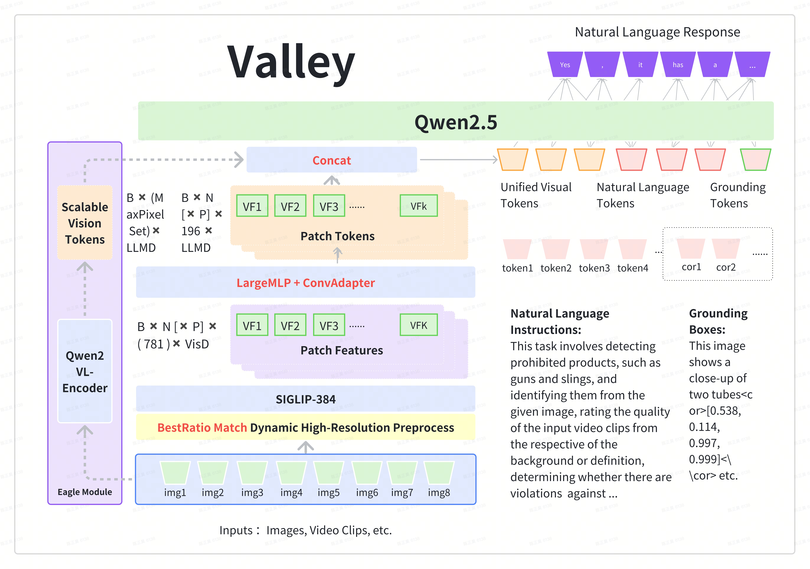

# Valley 2.0

<p align="center">
    
<p>

<p align="center">
🎮️ <a href="https://github.com/bytedance/Valley">Github</a>&nbsp&nbsp | &nbsp&nbsp 🤗 <a href="https://huggingface.co/bytedance-research/Valley-Eagle-7B">Hugging Face</a>&nbsp&nbsp | &nbsp&nbsp🤖 <a href="https://www.modelscope.cn/models/Hyggge/Valley-Eagle-7B">ModelScope</a> &nbsp&nbsp | &nbsp&nbsp 📑 <a href="https://hyggge.github.io/projects/valley/index.html">Home Page</a> &nbsp&nbsp | &nbsp&nbsp 📙 <a href="https://arxiv.org/abs/2501.05901">Paper</a> 
</p>

## Introduction
Valley is a cutting-edge multimodal large model designed to handle a variety of tasks involving text, images, and video data, which is developed by ByteDance. Our model not only

- Achieved the best results in the inhouse e-commerce and short-video benchmarks
- Demonstrated comparatively outstanding performance in the OpenCompass (average scores > 67) tests

when evaluated against models of the same scale. 

## Release
- [02/15] 🔥 Update Valley-Eagle-DPO, achieve 69.6 on OpenCompass and update AutoModel usage for checkpoints.
- [01/13] 🔥 Release TechReport. [Valley2: Exploring Multimodal Models with Scalable Vision-Language Design](https://arxiv.org/abs/2501.05901)
- [12/23] Announcing [Valley-Qwen2.5-7B](https://huggingface.co/ByteDance)!

## Valley-Eagle
The foundational version of Valley is a multimodal large model aligned with Siglip and Qwen2.5, incorporating LargeMLP and ConvAdapter to construct the projector. 

- In the final version, we also referenced Eagle, introducing an additional VisionEncoder that can flexibly adjust the number of tokens and is parallelized with the original visual tokens. 
- This enhancement supplements the model’s performance in extreme scenarios, and we chose the Qwen2vl VisionEncoder for this purpose. 

and the model structure is shown as follows:

<div style="display:flex;">
  
</div>


## Environment Setup
``` bash
pip install torch==2.4.0 torchvision==0.19.0 torchaudio==2.4.0 --index-url https://download.pytorch.org/whl/cu121
pip install -r requirements.txt
```

## License Agreement
All of our open-source models are licensed under the Apache-2.0 license.


## Related Project
We list related Project
- [Valley: Video Assistant with Large Language model Enhanced abilitY](https://github.com/RupertLuo/Valley)
- [LLaVA: Large Language and Vision Assistant](https://github.com/haotian-liu/LLaVA)
- [Eagle: Exploring The Design Space for Multimodal LLMs with Mixture of Encoders](https://github.com/NVlabs/EAGLE)
- [LLaVA-CoT: Let Vision Language Models Reason Step-by-Step](https://github.com/PKU-YuanGroup/LLaVA-CoT)
- [Qwen2.5](https://github.com/QwenLM/Qwen2.5)

## License Agreement
All of our open-source models are licensed under the [Apache-2.0](./LICENSE) license.

## We are Hiring
The Data-Ecommerce-Platform Governance-Basic Algorithms Team focuses on the research and development of multi-modal large model algorithms and foundational algorithms, continuously delving deeply into this field. Our mission is to optimize algorithms and collaborate with business teams to comprehensively govern the quality and ecosystem of ByteDance's e-commerce products. Currently, the team has a strong demand for foundational algorithm expertise in NLP, CV, and multimodal technologies. We welcome inquiries and look forward to working on challenging projects with talented individuals like you!

Location: Beijing / Shanghai / Singapore

Contact & Resume Submission: wuheng.2024@bytedance.com

> Tiktok-电商，基础算法团队专注于多模态大模型算法和基础算法的研发，并在此方向上持续深耕，期待和优秀的你（实习/全职），一起做有挑战的事情！
>
> 岗位城市：北京/上海/新加坡 
> 
> 咨询&简历投递：wuheng.2024@bytedance.com

## Citation
```
@article{wu2025valley2,
  title={Valley2: Exploring Multimodal Models with Scalable Vision-Language Design},
  author={Wu, Ziheng and Chen, Zhenghao and Luo, Ruipu and Zhang, Can and Gao, Yuan and He, Zhentao and Wang, Xian and Lin, Haoran and Qiu, Minghui},
  journal={arXiv preprint arXiv:2501.05901},
  year={2025}
}
```
